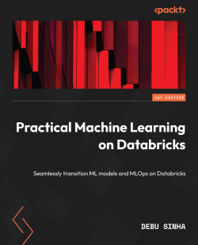

# Hey, I'm Debu Sinha

**Principal ML Engineer** @ Databricks | Author | Open Source Contributor | IEEE Senior Member

Architect of ML platforms at scale. Designing cross-ecosystem GenAI evaluation infrastructure used by **18M+ developers monthly**.

---

## Impact at a Glance

<table>
<tr>
<td align="center"><b>18M+</b><br/>Monthly PyPI Downloads<br/>(MLflow ecosystem)</td>
<td align="center"><b>7</b><br/>PRs Merged to MLflow<br/>(Core contributor)</td>
<td align="center"><b>4</b><br/>Ecosystem Integrations<br/>(Phoenix, TruLens, Guardrails, Modal)</td>
<td align="center"><b>1</b><br/>Published Book<br/>(Best-seller)</td>
</tr>
</table>

---

## Tech Stack

<p align="left">


</p>

---

## Open Source Contributions

### MLflow Core Contributor

Active contributor to [**MLflow**](https://github.com/mlflow/mlflow) (23K+ stars, 18M+ monthly downloads) - the industry-standard open-source ML lifecycle platform.

#### Unified LLM Evaluation Ecosystem

Designed and implemented a cross-ecosystem integration architecture connecting MLflow's GenAI evaluation with major LLM evaluation frameworks:

| Integration | Status | PR | Impact |
|-------------|--------|-----|--------|
| **Phoenix (Arize)** | ✅ Merged | [#19473](https://github.com/mlflow/mlflow/pull/19473) | Hallucination, Relevance, QA, Summarization scorers |
| **TruLens** | ✅ Merged | [#19492](https://github.com/mlflow/mlflow/pull/19492) | Groundedness, Context Relevance, Agent Trace evaluation |
| **Guardrails AI** | ✅ Merged | [#20038](https://github.com/mlflow/mlflow/pull/20038) | ToxicLanguage, DetectPII, DetectJailbreak (deterministic) |

**Combined ecosystem reach: 18.8M+ monthly PyPI downloads**

#### UV Package Manager Integration

Leading the native [UV](https://github.com/astral-sh/uv) integration for MLflow - automatic dependency inference for modern Python projects:

| Feature | Status | PR |
|---------|--------|-----|
| UV Auto-detection & Export | 🔄 In Review | [#20344](https://github.com/mlflow/mlflow/pull/20344) |
| Dependency Groups & Extras | 🔄 In Review | [#20344](https://github.com/mlflow/mlflow/pull/20344) |
| UV Sync for Environment Restoration | 🔄 In Review | [#20344](https://github.com/mlflow/mlflow/pull/20344) |

[Design Doc](https://github.com/debu-sinha/design-docs/blob/main/mlflow/uv-support-design-doc-v2.md) | [GitHub Issue #12478](https://github.com/mlflow/mlflow/issues/12478)

#### Core Infrastructure Improvements

| PR | Feature | Status |
|----|---------|--------|
| [#19152](https://github.com/mlflow/mlflow/pull/19152) | `inference_params` for LLM Judges (temperature, top_p) | ✅ Merged |
| [#19248](https://github.com/mlflow/mlflow/pull/19248) | Configurable parallelism (`MLFLOW_GENAI_EVAL_MAX_SCORER_WORKERS`) | ✅ Merged |

---

### Cross-Ecosystem Contributions

Fixing bugs and improving interoperability across the ML/AI ecosystem:

| Repository | Contribution | Status |
|------------|--------------|--------|
| [truera/trulens](https://github.com/truera/trulens/pull/2328) | Fix instrumentation crash on non-callable objects | ✅ Merged |
| [truera/trulens](https://github.com/truera/trulens/pull/2308) | Databricks structured outputs compatibility | ✅ Merged |
| [langchain-ai/langgraph](https://github.com/langchain-ai/langgraph/pull/6547) | Fix type signature for conditional edges | 🔄 Open |
| [langchain-ai/langgraph](https://github.com/langchain-ai/langgraph/pull/6544) | Handle functools.partial in ToolNode | 🔄 Open |

---

### MLflow-Modal Plugin

[](https://pypi.org/project/mlflow-modal-deploy/)
[](https://pypi.org/project/mlflow-modal-deploy/)

Serverless GPU deployment for MLflow models on [Modal](https://modal.com):

```bash
pip install mlflow-modal-deploy
mlflow deployments create -t modal -m models:/my-model/1 --name my-deployment
```

**Features:**
- Auto-scaling from zero to thousands of GPUs (T4 to H200)
- Sub-second cold starts with Modal's container snapshots
- Native MLflow deployment interface
- Private repository and custom dependencies support

[GitHub](https://github.com/debu-sinha/mlflow-modal-deploy) | [PyPI](https://pypi.org/project/mlflow-modal-deploy/)

---

## Book

<a href="https://www.amazon.com/dp/1801812039">

</a>

### [Practical Machine Learning on Databricks](https://www.amazon.com/dp/1801812039)
**Packt Publishing, 2023** | 244 pages

End-to-end guide for building production ML systems on Databricks - from data engineering to MLOps. **Best-seller in its category within 2 weeks of release.**

<br clear="left"/>

---

## Research

<a href="https://scholar.google.com/citations?user=V2LfrPwAAAAJ&hl=en"></a>  **Research Affiliate, Johns Hopkins University**

### AI Reliability Under Distribution Shift

| Paper | Focus | Link |
|-------|-------|------|
| **The Semantic Illusion** | Embedding-based hallucination detection fails on RLHF outputs | [arXiv:2512.15068](https://arxiv.org/abs/2512.15068) |
| **Demystifying Large Language Models** | LLM architecture and applications survey | [IJCET](https://iaeme.com/MasterAdmin/Journal_uploads/IJCET/VOLUME_16_ISSUE_1/IJCET_16_01_180.pdf) |
| **Reinforcement Learning for Real-World Impact** | RL applications and challenges | [IJSRCET](https://ijsrcseit.com/index.php/home/article/view/CSEIT251112170/CSEIT251112170) |
| **AI in Healthcare** | Data to patient outcomes pipeline | [IRJMETS](https://www.irjmets.com/uploadedfiles/paper//issue_2_february_2025/67992/final/fin_irjmets1740491159.pdf) |

---

## Featured Projects

| Project | Description | Stars |
|---------|-------------|-------|
| [Databricks-GenAI-Series](https://github.com/debu-sinha/Databricks-GenAI-Series) | Comprehensive GenAI hands-on workshop materials | ⭐ 24 |
| [mlflow-modal-deploy](https://github.com/debu-sinha/mlflow-modal-deploy) | Serverless GPU deployment plugin for MLflow | [](https://pypi.org/project/mlflow-modal-deploy/) |
| [finance-forecast-app](https://github.com/debu-sinha/finance-forecast-app) | Production forecasting with MLflow tracking | - |
| [techfutures-2025-mlops-databricks](https://github.com/debu-sinha/techfutures-2025-mlops-databricks) | End-to-end MLOps workshop (NYC 2025) | ⭐ 2 |
| [cross-region-model-serving-dab](https://github.com/debu-sinha/cross-region-model-serving-dab) | Cross-region ML serving with Delta Sharing | ⭐ 1 |

---

## Speaking & Teaching

| Event | Topic | Resources |
|-------|-------|-----------|
| **TechFutures 2025** (NYC) | End-to-End MLOps Pipelines Workshop | [GitHub](https://github.com/debu-sinha/techfutures-2025-mlops-databricks) |
| **Data Con LA 2022** | Simplifying AI/ML using Databricks Feature Store | [YouTube](https://www.youtube.com/watch?v=xPuCCY93BMY) |
| **Data Con LA 2021** | Detecting Fake Reviews at Scale | [YouTube](https://www.youtube.com/watch?v=5SA2GT-vBvY) |
| **NYU Guest Lecture** | ML Pipeline with Apache Spark | - |

---

## Professional Memberships

<p align="left">


</p>

---

## GitHub Stats

<p align="left">

</p>

---

## Connect

<p align="left">
<a href="https://www.linkedin.com/in/debusinha/"></a>
<a href="mailto:debusinha2009@gmail.com"></a>
<a href="https://scholar.google.com/citations?user=V2LfrPwAAAAJ"></a>
</p>

---

<p align="left">

</p>
