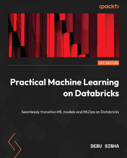

# Debu Sinha

**Applied AI/ML** @ Databricks | Author | IEEE Senior Member

I build evaluation and safety infrastructure for AI systems. Most of my recent open-source work is in LLM evaluation frameworks, AI safety tooling, and deployment infrastructure.

---

## Inspect AI (UK AI Safety Institute)

[Inspect AI](https://github.com/UKGovernmentBEIS/inspect_ai) is the UK government's framework for evaluating AI model capabilities and safety (31M+ monthly PyPI downloads).

- **[MLflow tracking hook](https://github.com/UKGovernmentBEIS/inspect_ai/pull/3433)** - Hierarchical experiment tracking with per-sample metrics and real-time event streaming via `on_sample_event`
- **[Artifact logging extension](https://github.com/UKGovernmentBEIS/inspect_ai/pull/3483)** - Sample result tables and eval log artifacts for post-hoc analysis
- **[Extensions page listing](https://github.com/UKGovernmentBEIS/inspect_ai/pull/3492)** - Added MLflow hook to the Inspect extensions registry

First hook integration to use the real-time `on_sample_event` API for per-call model and tool event tracking.

---

## MLflow Core Contributor

[MLflow](https://github.com/mlflow/mlflow) is the most widely adopted open-source ML lifecycle platform (23K+ stars, 18M+ monthly PyPI downloads).

### GenAI Evaluation Framework

Built the third-party scorer integrations that connect MLflow's evaluation framework to external AI safety and quality libraries:

- **[Phoenix (Arize)](https://github.com/mlflow/mlflow/pull/19473)** - Hallucination detection, relevance scoring, QA correctness, summarization quality
- **[TruLens](https://github.com/mlflow/mlflow/pull/19492)** - Groundedness, context relevance, and agent trace evaluation based on the [Agent GPA framework](https://arxiv.org/abs/2510.08847)
- **[Guardrails AI](https://github.com/mlflow/mlflow/pull/20038)** - Deterministic safety validators (toxicity, PII, jailbreak) with zero LLM dependency

### Infrastructure

- **[uv package manager support](https://github.com/mlflow/mlflow/pull/20344)** - Native uv lock file detection and dependency resolution for model logging (+1,780 lines)
- **[LLM Judge inference parameters](https://github.com/mlflow/mlflow/pull/19152)** - Temperature, top_p, max_tokens control for evaluation reproducibility
- **[Scorer parallelism](https://github.com/mlflow/mlflow/pull/19248)** - `MLFLOW_GENAI_EVAL_MAX_SCORER_WORKERS` for resource-constrained environments

### Blog Posts

- **[Evaluating LLMs with TruLens and MLflow](https://mlflow.org/blog/mlflow-trulens-evaluation)** - Co-authored with Josh Reini (Snowflake)
- **[Third-Party Scorers for GenAI Evaluation](https://mlflow.org/blog/third-party-scorers)** - MLflow ecosystem evaluation guide

---

## LlamaIndex Security

Hardened LlamaIndex against code execution vulnerabilities and improved API reliability:

- **[Sandbox LLM code execution](https://github.com/run-llama/llama_index/pull/20676)** - Eliminated arbitrary code execution in EvaporateExtractor
- **[Block filesystem/network I/O](https://github.com/run-llama/llama_index/pull/20691)** - Sandboxed safe_exec and safe_eval with timeout enforcement
- **[Replace eval() with json.loads](https://github.com/run-llama/llama_index/pull/20675)** - Closed code injection vector in FaissMapVectorStore
- **[Token-bucket rate limiter](https://github.com/run-llama/llama_index/pull/20712)** - Shared rate limiter for LLM and embedding calls with burst support
- **[Retry and error handling](https://github.com/run-llama/llama_index/pull/20693)** - Graceful degradation for BaseExtractor failures

---

## Other Contributions

**TruLens (Snowflake)** - [Instrumentation crash fix](https://github.com/truera/trulens/pull/2328), [Databricks compatibility](https://github.com/truera/trulens/pull/2308), [MLflow integration docs](https://github.com/truera/trulens/pull/2344), [pkg_resources fix](https://github.com/truera/trulens/pull/2351)

**Guardrails AI** - [Dynamic registry loading](https://github.com/guardrails-ai/guardrails/pull/1422), [uv support with validator registry](https://github.com/guardrails-ai/guardrails/pull/1416), [Hub API key fix](https://github.com/guardrails-ai/guardrails/pull/1403), [MLflow integration docs](https://github.com/guardrails-ai/guardrails/pull/1394)

---

## MLflow-Modal Plugin

[](https://pypi.org/project/mlflow-modal-deploy/)
[](https://pypi.org/project/mlflow-modal-deploy/)

Deploy MLflow models to serverless GPUs with auto-scaling from zero to H200s.

```bash
pip install mlflow-modal-deploy
```

[GitHub](https://github.com/debu-sinha/mlflow-modal-deploy) | [PyPI](https://pypi.org/project/mlflow-modal-deploy/)

---

## Publications

<a href="https://www.amazon.com/dp/1801812039">

</a>

**[Practical Machine Learning on Databricks](https://www.amazon.com/dp/1801812039)**
<br/>Packt Publishing, 2023 | 244 pages

<br clear="left"/>

<a href="https://scholar.google.com/citations?user=V2LfrPwAAAAJ&hl=en"></a>

| Paper | Venue |
|-------|-------|
| [The Semantic Illusion](https://arxiv.org/abs/2512.15068) | arXiv 2025 |
| [Learning to Translate with Products of Novices](https://aclanthology.org/Q13-1014/) | TACL 2013 |

---

## Speaking

| Event | Topic |
|-------|-------|
| ODSC AI East 2026 (Boston) | MLflow Evaluation Ecosystem (upcoming, Apr 28-30) |
| TechFutures 2025 (NYC) | [End-to-End MLOps Workshop](https://github.com/debu-sinha/techfutures-2025-mlops-databricks) |
| [Hevo Data Panel](https://hevodata.com/webinar/building-and-managing-the-modern-datastore-the-data-lakehouse/) | Building and Managing the Modern Data Lakehouse |
| Data Con LA 2022 | [Databricks Feature Store](https://www.youtube.com/watch?v=xPuCCY93BMY) |
| Data Con LA 2021 | [Fraud Detection at Scale](https://www.youtube.com/watch?v=5SA2GT-vBvY) |
| [Databricks Community Talk](https://www.youtube.com/watch?v=btEya9kdW4Y) | ML on Databricks |
| NYU Guest Lecture | ML Pipelines with Apache Spark |

---

**IEEE Senior Member** - Requires 10+ years experience and documented contributions to the profession.

---

<p align="left">
<a href="https://www.linkedin.com/in/debusinha/"></a>
<a href="mailto:debusinha2009@gmail.com"></a>
<a href="https://scholar.google.com/citations?user=V2LfrPwAAAAJ"></a>
</p>
